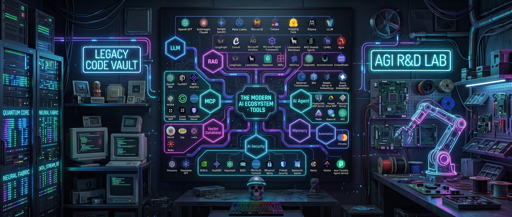

<!-- Баннер -->

  

<h1 align="center">Hi there, I'm Pavel! </h1>

  <b>Lead Software Engineer | Backend Architecture | Local AI & Infrastructure</b>

  <i>Специализируюсь на разработке высоконагруженных микросервисов, оптимизации баз данных и развертывании автономных ИИ-сред. Увлекаюсь сетями, контейнеризацией и созданием надежной инфраструктуры.</i>

 

### 🛠 Tech Stack & Tools

*Здесь собраны основные технологии, с которыми я работаю каждый день:*

**Backend & Architecture**  

**Infrastructure & DevOps**  

**AI & Workflow**  

 
<!--
### ⚡ GitHub Stats

  

 
-->

### ⚡ GitHub Activity

 

### ⚡ Terminal

  <a href="https://git.io/typing-svg">
    _+" alt="Typing SVG" />
  </a>

 

### 🚀 Текущие фокусы и интересы
- Развитие и оптимизация микросервисных архитектур.
- Эксперименты с локальными LLM-агентами (Claude Code, Google Antigravity).
- Построение защищенных P2P-сетей и настройка кастомной маршрутизации трафика (Entware, ByeDPI).
